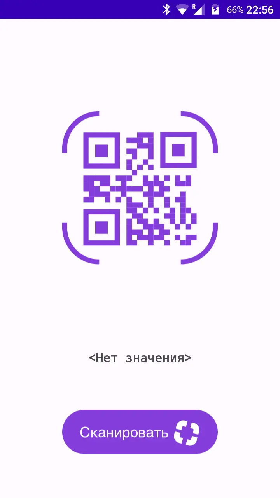
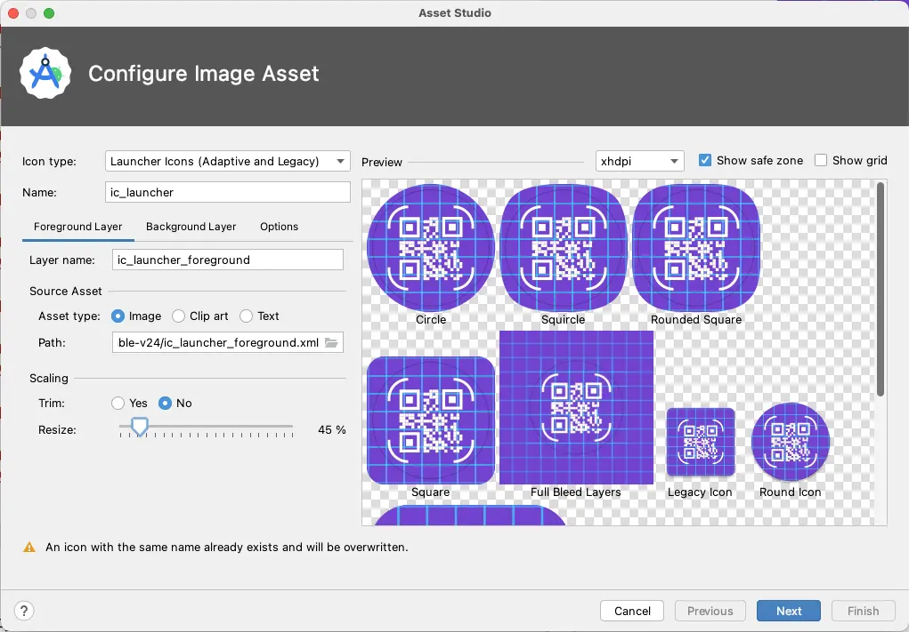
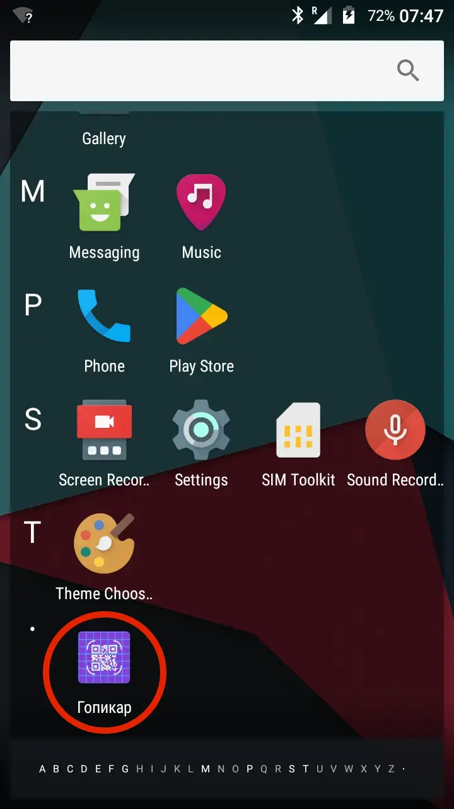

# Simple QR scan app


How to generate an icon:


Now the app's icon looks like this:

## Known issues:
### java.lang.NoSuchMethodError: No interface method sort(Ljava/util/Comparator;)V in class Ljava/util/List; or its super classes (declaration of 'java.util.List' appears in /system/framework/core-libart.jar)
If you get this error in the Zxing core lib in com.google.zxing.qrcode.detector.FinderPatternFinder.selectBestPatterns you can solve it by downgrading Zxing to 3.3.x (3.3.3 currently).
OR just add following in App level gradle
```groovy
android{
    compileOptions {
        coreLibraryDesugaringEnabled true
        sourceCompatibility = '1.8'
        targetCompatibility = '1.8'
    }

}
dependencies {
    coreLibraryDesugaring 'com.android.tools:desugar_jdk_libs:1.1.5'
}
```

### Android resource linking failed /layout/code_scanner.xml
remove those files.